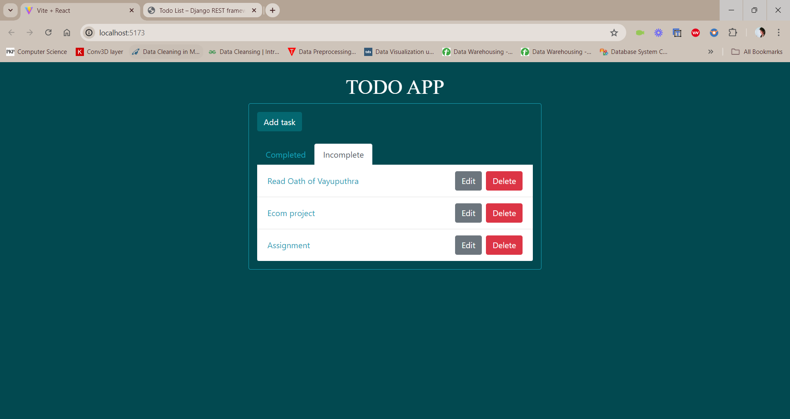

# Todo App

A simple and efficient Todo application built with React for the frontend and Django for the backend. This app allows users to manage their tasks effectively.

## Features

- Add, edit, and delete tasks
- Mark tasks as completed or incomplete
- Filter tasks by their status (completed or incomplete)

## Technologies Used

- **Frontend:** React JS
- **Backend:** Django
- **Database:** MySQL
- **HTTP Client:** Axios

